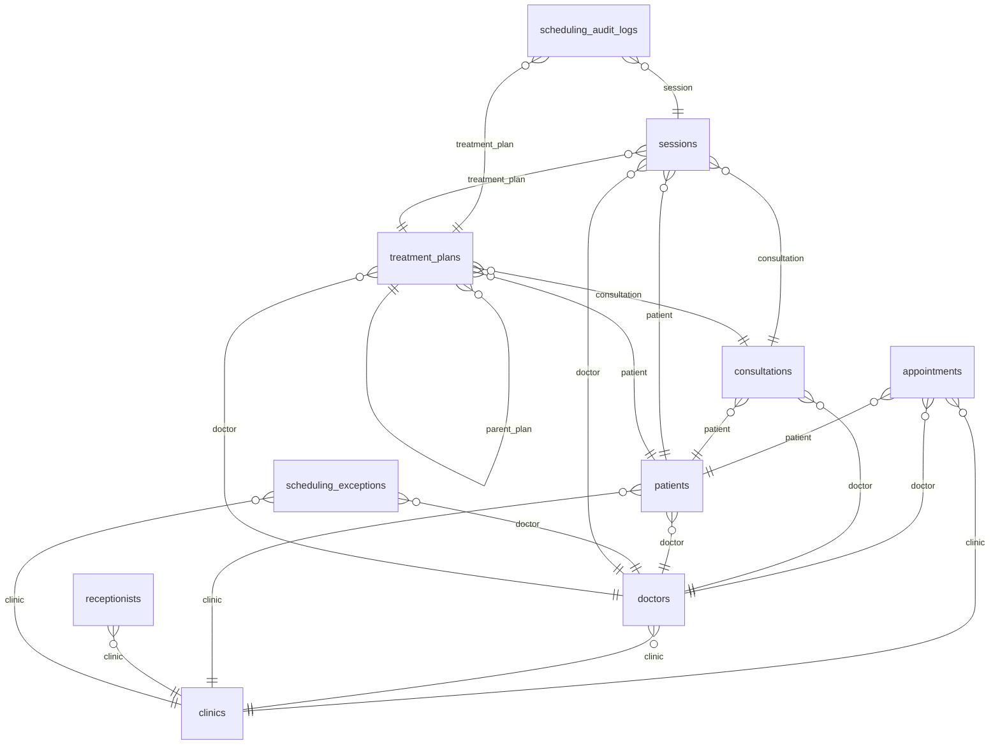

# PocketBase Database Security & Structure Report

> **Generated:** 2026-08-26T07:25:03.631215Z UTC  
> **Data Source:** Live PocketBase Server: https://api.needil.com  
> **Total Collections:** 19  
> **Total Foreign-Key Relations:** 21  

## 1. Security Overview & API Rule Audit

| Collection | Type | List Rule | View Rule | Create Rule | Update Rule | Delete Rule |
| :--- | :--- | :--- | :--- | :--- | :--- | :--- |
| **`appointments`** | `base` | 🟡 `clinic.id = @request.auth.id || clinic.id = @re...` | 🟡 `clinic.id = @request.auth.id || clinic.id = @re...` | 🟡 `@request.auth.id != '' && (clinic.id = @request...` | 🟡 `clinic.id = @request.auth.id || clinic.id = @re...` | 🟡 `clinic.id = @request.auth.id || clinic.id = @re...` |
| **`audit_logs`** | `base` | 🔒 `null` | 🔒 `null` | 🟡 `@request.auth.id != ''` | 🔒 `null` | 🔒 `null` |
| **`clinic_reactivation_requests`** | `base` | 🟡 `clinic_id = @request.auth.id || clinic_id = @re...` | 🟡 `clinic_id = @request.auth.id || clinic_id = @re...` | 🟡 `@request.auth.id != '' && (clinic_id = @request...` | 🔒 `null` | 🔒 `null` |
| **`clinics`** | `auth` | 🟡 `@request.auth.id = id || @request.auth.clinic = id` | 🟡 `@request.auth.id = id || @request.auth.clinic = id` | 🔴 `""` *(Open)* | 🟡 `@request.auth.id = id` | 🔒 `null` |
| **`consent_records`** | `base` | 🟡 `@request.auth.id != '' && user_id = @request.au...` | 🟡 `@request.auth.id != '' && user_id = @request.au...` | 🟡 `@request.auth.id != '' && user_id = @request.au...` | 🟡 `@request.auth.id != '' && user_id = @request.au...` | 🔒 `null` |
| **`consultations`** | `base` | 🟡 `doctor.clinic = @request.auth.id || doctor.clin...` | 🟡 `doctor.clinic = @request.auth.id || doctor.clin...` | 🟡 `@request.auth.id != '' && (doctor.clinic = @req...` | 🟡 `doctor.clinic = @request.auth.id || doctor.clin...` | 🟡 `doctor.clinic = @request.auth.id || doctor.clin...` |
| **`doctors`** | `auth` | 🟡 `clinic.id = @request.auth.id || clinic.id = @re...` | 🟡 `clinic.id = @request.auth.id || clinic.id = @re...` | 🟡 `@request.auth.id != '' && (clinic.id = @request...` | 🟡 `@request.auth.id = id || clinic.id = @request.a...` | 🟡 `clinic.id = @request.auth.id` |
| **`patients`** | `base` | 🟡 `clinic.id = @request.auth.id || clinic.id = @re...` | 🟡 `clinic.id = @request.auth.id || clinic.id = @re...` | 🟡 `@request.auth.id != '' && (clinic.id = @request...` | 🟡 `clinic.id = @request.auth.id || clinic.id = @re...` | 🟡 `clinic.id = @request.auth.id || clinic.id = @re...` |
| **`receptionists`** | `auth` | 🟡 `clinic.id = @request.auth.id || clinic.id = @re...` | 🟡 `clinic.id = @request.auth.id || clinic.id = @re...` | 🟡 `@request.auth.id != '' && (clinic.id = @request...` | 🟡 `@request.auth.id = id || clinic.id = @request.a...` | 🟡 `clinic.id = @request.auth.id` |
| **`scheduling_audit_logs`** | `base` | 🟡 `treatment_plan.doctor.clinic = @request.auth.id...` | 🟡 `treatment_plan.doctor.clinic = @request.auth.id...` | 🟡 `@request.auth.id != '' && (treatment_plan.docto...` | 🔒 `null` | 🔒 `null` |
| **`scheduling_exceptions`** | `base` | 🟡 `clinic.id = @request.auth.id || clinic.id = @re...` | 🟡 `clinic.id = @request.auth.id || clinic.id = @re...` | 🟡 `@request.auth.id != '' && (clinic.id = @request...` | 🟡 `clinic.id = @request.auth.id || clinic.id = @re...` | 🟡 `clinic.id = @request.auth.id || clinic.id = @re...` |
| **`sessions`** | `base` | 🟡 `doctor.clinic = @request.auth.id || doctor.clin...` | 🟡 `doctor.clinic = @request.auth.id || doctor.clin...` | 🟡 `@request.auth.id != '' && (doctor.clinic = @req...` | 🟡 `doctor.clinic = @request.auth.id || doctor.clin...` | 🟡 `doctor.clinic = @request.auth.id || doctor.clin...` |
| **`system_settings`** | `base` | 🟡 `@request.auth.id != ''` | 🟡 `@request.auth.id != ''` | 🔒 `null` | 🔒 `null` | 🔒 `null` |
| **`treatment_plans`** | `base` | 🟡 `doctor.clinic = @request.auth.id || doctor.clin...` | 🟡 `doctor.clinic = @request.auth.id || doctor.clin...` | 🟡 `@request.auth.id != '' && (doctor.clinic = @req...` | 🟡 `doctor.clinic = @request.auth.id || doctor.clin...` | 🟡 `doctor.clinic = @request.auth.id || doctor.clin...` |
| **`_authOrigins`** | `base` | 🟡 `@request.auth.id != '' && recordRef = @request....` | 🟡 `@request.auth.id != '' && recordRef = @request....` | 🔒 `null` | 🔒 `null` | 🟡 `@request.auth.id != '' && recordRef = @request....` |
| **`_externalAuths`** | `base` | 🟡 `@request.auth.id != '' && recordRef = @request....` | 🟡 `@request.auth.id != '' && recordRef = @request....` | 🔒 `null` | 🔒 `null` | 🟡 `@request.auth.id != '' && recordRef = @request....` |
| **`_mfas`** | `base` | 🟡 `@request.auth.id != '' && recordRef = @request....` | 🟡 `@request.auth.id != '' && recordRef = @request....` | 🔒 `null` | 🔒 `null` | 🔒 `null` |
| **`_otps`** | `base` | 🟡 `@request.auth.id != '' && recordRef = @request....` | 🟡 `@request.auth.id != '' && recordRef = @request....` | 🔒 `null` | 🔒 `null` | 🔒 `null` |
| **`_superusers`** | `auth` | 🔒 `null` | 🔒 `null` | 🔒 `null` | 🔒 `null` | 🔒 `null` |

> [!WARNING]
> **Public Open Endpoints Detected (`""` rule - No authentication required):**
> - `clinics.create`

## 2. Database Entity-Relationship Diagram



## 3. Foreign Key Relations Matrix

| Source Collection | Field Name | Target Collection | Cardinality | Cascade Delete | Required |
| :--- | :--- | :--- | :--- | :--- | :--- |
| **`appointments`** | `patient` | **`patients`** | Many-to-One (N:1) | ❌ No | ❌ No |
| **`appointments`** | `doctor` | **`doctors`** | Many-to-One (N:1) | ❌ No | ✅ Yes |
| **`appointments`** | `clinic` | **`clinics`** | Many-to-One (N:1) | ❌ No | ❌ No |
| **`consultations`** | `doctor` | **`doctors`** | Many-to-One (N:1) | ❌ No | ❌ No |
| **`consultations`** | `patient` | **`patients`** | Many-to-One (N:1) | ❌ No | ❌ No |
| **`doctors`** | `clinic` | **`clinics`** | Many-to-One (N:1) | ❌ No | ❌ No |
| **`patients`** | `doctor` | **`doctors`** | Many-to-One (N:1) | ❌ No | ✅ Yes |
| **`patients`** | `clinic` | **`clinics`** | Many-to-One (N:1) | ❌ No | ❌ No |
| **`receptionists`** | `clinic` | **`clinics`** | Many-to-One (N:1) | ❌ No | ❌ No |
| **`scheduling_audit_logs`** | `session` | **`sessions`** | Many-to-One (N:1) | ❌ No | ❌ No |
| **`scheduling_audit_logs`** | `treatment_plan` | **`treatment_plans`** | Many-to-One (N:1) | ❌ No | ✅ Yes |
| **`scheduling_exceptions`** | `doctor` | **`doctors`** | Many-to-One (N:1) | ❌ No | ❌ No |
| **`scheduling_exceptions`** | `clinic` | **`clinics`** | Many-to-One (N:1) | ❌ No | ❌ No |
| **`sessions`** | `doctor` | **`doctors`** | Many-to-One (N:1) | ❌ No | ❌ No |
| **`sessions`** | `treatment_plan` | **`treatment_plans`** | Many-to-One (N:1) | ❌ No | ❌ No |
| **`sessions`** | `patient` | **`patients`** | Many-to-One (N:1) | ❌ No | ❌ No |
| **`sessions`** | `consultation` | **`consultations`** | Many-to-One (N:1) | ❌ No | ❌ No |
| **`treatment_plans`** | `parent_plan` | **`treatment_plans`** | Many-to-One (N:1) | ❌ No | ❌ No |
| **`treatment_plans`** | `patient` | **`patients`** | Many-to-One (N:1) | ❌ No | ❌ No |
| **`treatment_plans`** | `doctor` | **`doctors`** | Many-to-One (N:1) | ❌ No | ❌ No |
| **`treatment_plans`** | `consultation` | **`consultations`** | Many-to-One (N:1) | ❌ No | ❌ No |

## 4. Detailed Collection Specifications

### Collection: `appointments`

- **Collection ID:** `pbc_1037645436`
- **Type:** `base` 

#### API Access Rules
```
List Rule:   clinic.id = @request.auth.id || clinic.id = @request.auth.clinic
View Rule:   clinic.id = @request.auth.id || clinic.id = @request.auth.clinic
Create Rule: @request.auth.id != '' && (clinic.id = @request.auth.id || clinic.id = @request.auth.clinic)
Update Rule: clinic.id = @request.auth.id || clinic.id = @request.auth.clinic
Delete Rule: clinic.id = @request.auth.id || clinic.id = @request.auth.clinic
```

#### Database Indexes (4)
- `CREATE INDEX idx_appointments_clinic_date ON appointments (clinic, date);`
- `CREATE INDEX idx_appointments_doctor_date ON appointments (doctor, date);`
- `CREATE INDEX idx_appointments_patient ON appointments (patient);`
- `CREATE INDEX idx_appointments_linked_session_id ON appointments (linked_session_id);`

#### Fields (28)

| Field Name | Type | Required | Unique | System | Details / Target / Constraints |
| :--- | :--- | :--- | :--- | :--- | :--- |
| **`id`** | `text` | ✅ | — | 🔒 | min: 15; max: 15; pattern: `^[a-z0-9]+$` |
| **`patient`** | `relation` | — | — | — | -> **`patients`** (max: 1) |
| **`doctor`** | `relation` | ✅ | — | — | -> **`doctors`** (max: 1) |
| **`clinic`** | `relation` | — | — | — | -> **`clinics`** (max: 1) |
| **`type`** | `select` | ✅ | — | — | Options: `[call_by, walk_in, session]` (max: 0) |
| **`date`** | `text` | ✅ | — | — | — |
| **`time`** | `text` | ✅ | — | — | — |
| **`status`** | `select` | ✅ | — | — | Options: `[scheduled, in_progress, completed, cancelled, waiting]` (max: 0) |
| **`patient_name`** | `text` | — | — | — | — |
| **`patient_phone`** | `text` | — | — | — | — |
| **`check_in_time`** | `date` | — | — | — | — |
| **`check_out_time`** | `date` | — | — | — | — |
| **`consultation_start_time`** | `date` | — | — | — | — |
| **`consultation_end_time`** | `date` | — | — | — | — |
| **`patient_details_saved`** | `bool` | — | — | — | — |
| **`patient_details_partial`** | `bool` | — | — | — | — |
| **`treatment_plan_partial`** | `bool` | — | — | — | — |
| **`linked_treatment_plan_id`** | `text` | — | — | — | — |
| **`linked_consultation_id`** | `text` | — | — | — | — |
| **`session_type`** | `text` | — | — | — | — |
| **`previous_status`** | `text` | — | — | — | — |
| **`reconciliation_reason`** | `text` | — | — | — | — |
| **`reconciled_at`** | `date` | — | — | — | — |
| **`reconciled_by`** | `text` | — | — | — | — |
| **`linked_session_id`** | `text` | — | — | — | — |
| **`is_new_family_member`** | `bool` | — | — | — | — |
| **`intended_relation`** | `text` | — | — | — | — |
| **`patient_details_skipped`** | `bool` | — | — | — | — |

---

### Collection: `audit_logs`

- **Collection ID:** `pbc_681515208`
- **Type:** `base` 

#### API Access Rules
```
List Rule:   null (Superadmin Only)
View Rule:   null (Superadmin Only)
Create Rule: @request.auth.id != ''
Update Rule: null (Superadmin Only)
Delete Rule: null (Superadmin Only)
```

#### Fields (8)

| Field Name | Type | Required | Unique | System | Details / Target / Constraints |
| :--- | :--- | :--- | :--- | :--- | :--- |
| **`id`** | `text` | ✅ | — | 🔒 | min: 15; max: 15; pattern: `^[a-z0-9]+$` |
| **`user_id`** | `text` | — | — | — | — |
| **`user_role`** | `text` | — | — | — | — |
| **`action`** | `text` | — | — | — | — |
| **`details`** | `text` | — | — | — | — |
| **`target_id`** | `text` | — | — | — | — |
| **`timestamp`** | `text` | — | — | — | — |
| **`ip_address`** | `text` | — | — | — | — |

---

### Collection: `clinic_reactivation_requests`

- **Collection ID:** `pbc_3927828124`
- **Type:** `base` 

#### API Access Rules
```
List Rule:   clinic_id = @request.auth.id || clinic_id = @request.auth.clinic
View Rule:   clinic_id = @request.auth.id || clinic_id = @request.auth.clinic
Create Rule: @request.auth.id != '' && (clinic_id = @request.auth.id || clinic_id = @request.auth.clinic)
Update Rule: null (Superadmin Only)
Delete Rule: null (Superadmin Only)
```

#### Fields (11)

| Field Name | Type | Required | Unique | System | Details / Target / Constraints |
| :--- | :--- | :--- | :--- | :--- | :--- |
| **`id`** | `text` | ✅ | — | 🔒 | min: 15; max: 15; pattern: `^[a-z0-9]+$` |
| **`clinic_id`** | `text` | ✅ | — | — | — |
| **`clinic_name`** | `text` | — | — | — | — |
| **`requested_by`** | `text` | ✅ | — | — | — |
| **`requested_at`** | `text` | ✅ | — | — | — |
| **`reason`** | `text` | — | — | — | — |
| **`status`** | `text` | ✅ | — | — | — |
| **`reviewed_by`** | `text` | — | — | — | — |
| **`reviewed_at`** | `text` | — | — | — | — |
| **`created`** | `autodate` | — | — | — | — |
| **`updated`** | `autodate` | — | — | — | — |

---

### Collection: `clinics`

- **Collection ID:** `pbc_244677383`
- **Type:** `auth` 

#### API Access Rules
```
List Rule:   @request.auth.id = id || @request.auth.clinic = id
View Rule:   @request.auth.id = id || @request.auth.clinic = id
Create Rule: "" (Public Open)
Update Rule: @request.auth.id = id
Delete Rule: null (Superadmin Only)
Manage Rule: null (Superadmin Only)
Auth Rule:   
```

#### Auth Configuration
- **Password Auth Enabled:** true
- **Identity Fields:** `[username, email]`
- **MFA Enabled:** false
- **OTP Enabled:** true
- **Auth Token Duration:** `604800`

#### Database Indexes (3)
- `CREATE UNIQUE INDEX `idx_tokenKey_pbc_244677383` ON `clinics` (`tokenKey`)`
- `CREATE UNIQUE INDEX `idx_email_pbc_244677383` ON `clinics` (`email`) WHERE `email` != ''`
- `CREATE UNIQUE INDEX `idx_username_pbc_244677383` ON `clinics` (`username`)`

#### Referenced By (5 Inbound Relations)
- `appointments.clinic` (Many-to-One (N:1))
- `doctors.clinic` (Many-to-One (N:1))
- `patients.clinic` (Many-to-One (N:1))
- `receptionists.clinic` (Many-to-One (N:1))
- `scheduling_exceptions.clinic` (Many-to-One (N:1))

#### Fields (32)

| Field Name | Type | Required | Unique | System | Details / Target / Constraints |
| :--- | :--- | :--- | :--- | :--- | :--- |
| **`id`** | `text` | ✅ | — | 🔒 | min: 15; max: 15; pattern: `^[a-z0-9]+$` |
| **`password`** | `password` | ✅ | — | 🔒 | — |
| **`tokenKey`** | `text` | ✅ | — | 🔒 | min: 30; max: 60 |
| **`email`** | `email` | — | — | 🔒 | — |
| **`emailVisibility`** | `bool` | — | — | 🔒 | — |
| **`verified`** | `bool` | — | — | 🔒 | — |
| **`name`** | `text` | — | — | — | — |
| **`bed_count`** | `number` | — | — | — | min: 1 |
| **`clinic_id`** | `text` | — | — | — | — |
| **`username`** | `text` | — | — | — | — |
| **`phone`** | `text` | — | — | — | — |
| **`address`** | `text` | — | — | — | — |
| **`area`** | `text` | — | — | — | — |
| **`city`** | `text` | — | — | — | — |
| **`state`** | `text` | — | — | — | — |
| **`pin`** | `text` | — | — | — | — |
| **`location`** | `text` | — | — | — | — |
| **`logo`** | `file` | — | — | — | maxSelect: 1, maxSize: 0B |
| **`subscription_tier`** | `text` | — | — | — | min: 2 |
| **`max_doctors`** | `number` | — | — | — | — |
| **`photos_used`** | `number` | — | — | — | — |
| **`photo_limit`** | `number` | — | — | — | — |
| **`is_deactivated`** | `bool` | — | — | — | — |
| **`deactivated_at`** | `text` | — | — | — | — |
| **`scheduled_deletion_date`** | `text` | — | — | — | — |
| **`status`** | `text` | — | — | — | — |
| **`deletion_requested_at`** | `text` | — | — | — | — |
| **`purge_at`** | `text` | — | — | — | — |
| **`deletion_requested_by`** | `text` | — | — | — | — |
| **`deletion_reason`** | `text` | — | — | — | — |
| **`reactivation_requested_at`** | `text` | — | — | — | — |
| **`reactivation_reason`** | `text` | — | — | — | — |

---

### Collection: `consent_records`

- **Collection ID:** `pbc_1497466344`
- **Type:** `base` 

#### API Access Rules
```
List Rule:   @request.auth.id != '' && user_id = @request.auth.id
View Rule:   @request.auth.id != '' && user_id = @request.auth.id
Create Rule: @request.auth.id != '' && user_id = @request.auth.id
Update Rule: @request.auth.id != '' && user_id = @request.auth.id
Delete Rule: null (Superadmin Only)
```

#### Database Indexes (1)
- `CREATE INDEX idx_consent_records_patient_id ON consent_records (patient_id);`

#### Fields (12)

| Field Name | Type | Required | Unique | System | Details / Target / Constraints |
| :--- | :--- | :--- | :--- | :--- | :--- |
| **`id`** | `text` | ✅ | — | 🔒 | min: 15; max: 15; pattern: `^[a-z0-9]+$` |
| **`user_id`** | `text` | ✅ | — | — | — |
| **`consent_type`** | `text` | ✅ | — | — | — |
| **`purpose`** | `text` | — | — | — | — |
| **`withdrawn`** | `bool` | — | — | — | — |
| **`timestamp`** | `text` | — | — | — | — |
| **`patient_id`** | `text` | — | — | — | — |
| **`clinic_id`** | `text` | — | — | — | — |
| **`granted`** | `bool` | — | — | — | — |
| **`version`** | `text` | — | — | — | — |
| **`text_hash`** | `text` | — | — | — | — |
| **`taken_by_staff_id`** | `text` | — | — | — | — |

---

### Collection: `consultations`

- **Collection ID:** `pbc_3441013282`
- **Type:** `base` 

#### API Access Rules
```
List Rule:   doctor.clinic = @request.auth.id || doctor.clinic = @request.auth.clinic || patient.clinic = @request.auth.id || patient.clinic = @request.auth.clinic
View Rule:   doctor.clinic = @request.auth.id || doctor.clinic = @request.auth.clinic || patient.clinic = @request.auth.id || patient.clinic = @request.auth.clinic
Create Rule: @request.auth.id != '' && (doctor.clinic = @request.auth.id || doctor.clinic = @request.auth.clinic || patient.clinic = @request.auth.id || patient.clinic = @request.auth.clinic)
Update Rule: doctor.clinic = @request.auth.id || doctor.clinic = @request.auth.clinic || patient.clinic = @request.auth.id || patient.clinic = @request.auth.clinic
Delete Rule: doctor.clinic = @request.auth.id || doctor.clinic = @request.auth.clinic || patient.clinic = @request.auth.id || patient.clinic = @request.auth.clinic
```

#### Database Indexes (2)
- `CREATE INDEX idx_consultations_patient ON consultations (patient);`
- `CREATE INDEX idx_consultations_doctor ON consultations (doctor);`

#### Referenced By (2 Inbound Relations)
- `sessions.consultation` (Many-to-One (N:1))
- `treatment_plans.consultation` (Many-to-One (N:1))

#### Fields (33)

| Field Name | Type | Required | Unique | System | Details / Target / Constraints |
| :--- | :--- | :--- | :--- | :--- | :--- |
| **`id`** | `text` | ✅ | — | 🔒 | min: 15; max: 15; pattern: `^[a-z0-9]+$` |
| **`chief_complaint`** | `text` | — | — | — | — |
| **`medical_history`** | `text` | — | — | — | — |
| **`past_illnesses`** | `text` | — | — | — | — |
| **`current_medications`** | `text` | — | — | — | — |
| **`allergies`** | `text` | — | — | — | — |
| **`chronic_diseases`** | `text` | — | — | — | — |
| **`diet_pattern`** | `text` | — | — | — | — |
| **`sleep_quality`** | `text` | — | — | — | — |
| **`exercise_level`** | `text` | — | — | — | — |
| **`addictions`** | `text` | — | — | — | — |
| **`stress_level`** | `text` | — | — | — | — |
| **`pregnancy_status`** | `text` | — | — | — | — |
| **`consent_given`** | `text` | — | — | — | — |
| **`doctor`** | `relation` | — | — | — | -> **`doctors`** (max: 1) |
| **`patient`** | `relation` | — | — | — | -> **`patients`** (max: 1) |
| **`status`** | `select` | — | — | — | Options: `[ongoing, completed]` (max: 1) |
| **`photos`** | `file` | — | — | — | maxSelect: 99, maxSize: 0B, protected |
| **`previous_treatments`** | `text` | — | — | — | — |
| **`pain_areas`** | `text` | — | — | — | — |
| **`past_surgeries`** | `text` | — | — | — | — |
| **`sugar_level`** | `text` | — | — | — | — |
| **`vit_d3`** | `text` | — | — | — | — |
| **`vit_b12`** | `text` | — | — | — | — |
| **`thyroid_level`** | `text` | — | — | — | — |
| **`cholesterol_level`** | `text` | — | — | — | — |
| **`acupuncture_diagnosis`** | `text` | — | — | — | — |
| **`eye_diagnosis`** | `text` | — | — | — | — |
| **`pulse_diagnosis`** | `text` | — | — | — | — |
| **`corona_vaccinated`** | `bool` | — | — | — | — |
| **`charged`** | `bool` | — | — | — | — |
| **`is_deleted`** | `bool` | — | — | — | — |
| **`deleted_at`** | `date` | — | — | — | — |

---

### Collection: `doctors`

- **Collection ID:** `pbc_1877395423`
- **Type:** `auth` 

#### API Access Rules
```
List Rule:   clinic.id = @request.auth.id || clinic.id = @request.auth.clinic
View Rule:   clinic.id = @request.auth.id || clinic.id = @request.auth.clinic
Create Rule: @request.auth.id != '' && (clinic.id = @request.auth.id || @request.auth.collectionName = 'clinics')
Update Rule: @request.auth.id = id || clinic.id = @request.auth.id
Delete Rule: clinic.id = @request.auth.id
Manage Rule: null (Superadmin Only)
Auth Rule:   
```

#### Auth Configuration
- **Password Auth Enabled:** true
- **Identity Fields:** `[username]`
- **MFA Enabled:** false
- **OTP Enabled:** false
- **Auth Token Duration:** `604800`

#### Database Indexes (3)
- `CREATE UNIQUE INDEX `idx_tokenKey_pbc_1877395423` ON `doctors` (`tokenKey`)`
- `CREATE UNIQUE INDEX `idx_email_pbc_1877395423` ON `doctors` (`email`) WHERE `email` != ''`
- `CREATE UNIQUE INDEX `idx_username_pbc_1877395423` ON `doctors` (`username`)`

#### Referenced By (6 Inbound Relations)
- `appointments.doctor` (Many-to-One (N:1))
- `consultations.doctor` (Many-to-One (N:1))
- `patients.doctor` (Many-to-One (N:1))
- `scheduling_exceptions.doctor` (Many-to-One (N:1))
- `sessions.doctor` (Many-to-One (N:1))
- `treatment_plans.doctor` (Many-to-One (N:1))

#### Fields (21)

| Field Name | Type | Required | Unique | System | Details / Target / Constraints |
| :--- | :--- | :--- | :--- | :--- | :--- |
| **`id`** | `text` | ✅ | — | 🔒 | min: 15; max: 15; pattern: `^[a-z0-9]+$` |
| **`password`** | `password` | ✅ | — | 🔒 | — |
| **`tokenKey`** | `text` | ✅ | — | 🔒 | min: 30; max: 60 |
| **`email`** | `email` | — | — | 🔒 | — |
| **`emailVisibility`** | `bool` | — | — | 🔒 | — |
| **`verified`** | `bool` | — | — | 🔒 | — |
| **`name`** | `text` | ✅ | — | — | — |
| **`age`** | `number` | — | — | — | — |
| **`clinic`** | `relation` | — | — | — | -> **`clinics`** (max: 1) |
| **`is_primary`** | `bool` | — | — | — | — |
| **`working_schedule`** | `json` | — | — | — | — |
| **`treatments`** | `json` | — | — | — | — |
| **`share_past_patients`** | `bool` | — | — | — | — |
| **`share_future_patients`** | `bool` | — | — | — | — |
| **`date_of_birth`** | `text` | — | — | — | — |
| **`username`** | `text` | ✅ | — | — | — |
| **`phone`** | `text` | — | — | — | — |
| **`dob`** | `text` | — | — | — | — |
| **`photo`** | `file` | — | — | — | maxSelect: 1, maxSize: 0B |
| **`doctor_id`** | `text` | — | — | — | — |
| **`is_active`** | `bool` | — | — | — | — |

---

### Collection: `patients`

- **Collection ID:** `pbc_1820489269`
- **Type:** `base` 

#### API Access Rules
```
List Rule:   clinic.id = @request.auth.id || clinic.id = @request.auth.clinic
View Rule:   clinic.id = @request.auth.id || clinic.id = @request.auth.clinic
Create Rule: @request.auth.id != '' && (clinic.id = @request.auth.id || clinic.id = @request.auth.clinic)
Update Rule: clinic.id = @request.auth.id || clinic.id = @request.auth.clinic
Delete Rule: clinic.id = @request.auth.id || clinic.id = @request.auth.clinic
```

#### Database Indexes (3)
- `CREATE INDEX idx_patients_clinic_phone ON patients (clinic, phone);`
- `CREATE INDEX idx_patients_clinic_full_name ON patients (clinic, full_name);`
- `CREATE INDEX idx_patients_doctor ON patients (doctor);`

#### Referenced By (4 Inbound Relations)
- `appointments.patient` (Many-to-One (N:1))
- `consultations.patient` (Many-to-One (N:1))
- `sessions.patient` (Many-to-One (N:1))
- `treatment_plans.patient` (Many-to-One (N:1))

#### Fields (25)

| Field Name | Type | Required | Unique | System | Details / Target / Constraints |
| :--- | :--- | :--- | :--- | :--- | :--- |
| **`id`** | `text` | ✅ | — | 🔒 | min: 15; max: 15; pattern: `^[a-z0-9]+$` |
| **`full_name`** | `text` | ✅ | — | — | — |
| **`phone`** | `text` | ✅ | — | — | — |
| **`date_of_birth`** | `text` | — | — | — | — |
| **`address`** | `text` | — | — | — | — |
| **`emergency_contact`** | `text` | — | — | — | — |
| **`allergies_conditions`** | `text` | — | — | — | — |
| **`doctor`** | `relation` | ✅ | — | — | -> **`doctors`** (max: 1) |
| **`clinic`** | `relation` | — | — | — | -> **`clinics`** (max: 1) |
| **`consent_given`** | `bool` | — | — | — | — |
| **`gender`** | `select` | — | — | — | Options: `[Male, Female, Other]` (max: 1) |
| **`occupation`** | `text` | — | — | — | — |
| **`email`** | `email` | — | — | — | — |
| **`age`** | `number` | — | — | — | — |
| **`city`** | `text` | — | — | — | — |
| **`area`** | `text` | — | — | — | — |
| **`patient_id`** | `text` | — | — | — | — |
| **`photo`** | `file` | — | — | — | maxSelect: 1, maxSize: 0B, protected |
| **`reference`** | `text` | — | — | — | — |
| **`family_members`** | `json` | — | — | — | — |
| **`how_did_you_hear`** | `text` | — | — | — | — |
| **`privacy_policy_accepted_date`** | `text` | — | — | — | — |
| **`privacy_policy_accepted_`** | `bool` | — | — | — | — |
| **`relation_to_primary`** | `text` | — | — | — | — |
| **`personal_notes`** | `text` | — | — | — | — |

---

### Collection: `receptionists`

- **Collection ID:** `pbc_3026653995`
- **Type:** `auth` 

#### API Access Rules
```
List Rule:   clinic.id = @request.auth.id || clinic.id = @request.auth.clinic
View Rule:   clinic.id = @request.auth.id || clinic.id = @request.auth.clinic
Create Rule: @request.auth.id != '' && (clinic.id = @request.auth.id || @request.auth.collectionName = 'clinics')
Update Rule: @request.auth.id = id || clinic.id = @request.auth.id
Delete Rule: clinic.id = @request.auth.id
Manage Rule: null (Superadmin Only)
Auth Rule:   
```

#### Auth Configuration
- **Password Auth Enabled:** true
- **Identity Fields:** `[email]`
- **MFA Enabled:** false
- **OTP Enabled:** false
- **Auth Token Duration:** `604800`

#### Database Indexes (3)
- `CREATE UNIQUE INDEX `idx_tokenKey_whymz0yb6n` ON `receptionists` (`tokenKey`)`
- `CREATE UNIQUE INDEX `idx_email_whymz0yb6n` ON `receptionists` (
  `email`,
  `username`
) WHERE `email` != ''`
- `CREATE UNIQUE INDEX `idx_email_pbc_3026653995` ON `receptionists` (`email`) WHERE `email` != ''`

#### Fields (14)

| Field Name | Type | Required | Unique | System | Details / Target / Constraints |
| :--- | :--- | :--- | :--- | :--- | :--- |
| **`id`** | `text` | ✅ | — | 🔒 | min: 15; max: 15; pattern: `^[a-z0-9]+$` |
| **`password`** | `password` | ✅ | — | 🔒 | — |
| **`tokenKey`** | `text` | ✅ | — | 🔒 | min: 30; max: 60 |
| **`email`** | `email` | — | — | 🔒 | — |
| **`emailVisibility`** | `bool` | — | — | 🔒 | — |
| **`verified`** | `bool` | — | — | 🔒 | — |
| **`username`** | `text` | — | — | — | — |
| **`name`** | `text` | — | — | — | — |
| **`phone`** | `text` | — | — | — | — |
| **`clinic`** | `relation` | — | — | — | -> **`clinics`** (max: 1) |
| **`is_active`** | `bool` | — | — | — | — |
| **`receptionist_id`** | `text` | — | — | — | — |
| **`created`** | `autodate` | — | — | — | — |
| **`updated`** | `autodate` | — | — | — | — |

---

### Collection: `scheduling_audit_logs`

- **Collection ID:** `pbc_380216312`
- **Type:** `base` 

#### API Access Rules
```
List Rule:   treatment_plan.doctor.clinic = @request.auth.id || treatment_plan.doctor.clinic = @request.auth.clinic || treatment_plan.patient.clinic = @request.auth.id || treatment_plan.patient.clinic = @request.auth.clinic
View Rule:   treatment_plan.doctor.clinic = @request.auth.id || treatment_plan.doctor.clinic = @request.auth.clinic || treatment_plan.patient.clinic = @request.auth.id || treatment_plan.patient.clinic = @request.auth.clinic
Create Rule: @request.auth.id != '' && (treatment_plan.doctor.clinic = @request.auth.id || treatment_plan.doctor.clinic = @request.auth.clinic || treatment_plan.patient.clinic = @request.auth.id || treatment_plan.patient.clinic = @request.auth.clinic)
Update Rule: null (Superadmin Only)
Delete Rule: null (Superadmin Only)
```

#### Database Indexes (1)
- `CREATE INDEX idx_scheduling_audit_logs_treatment_plan ON scheduling_audit_logs (treatment_plan);`

#### Fields (15)

| Field Name | Type | Required | Unique | System | Details / Target / Constraints |
| :--- | :--- | :--- | :--- | :--- | :--- |
| **`id`** | `text` | ✅ | — | 🔒 | min: 15; max: 15; pattern: `^[a-z0-9]+$` |
| **`session`** | `relation` | — | — | — | -> **`sessions`** (max: 1) |
| **`treatment_plan`** | `relation` | ✅ | — | — | -> **`treatment_plans`** (max: 1) |
| **`action`** | `text` | ✅ | — | — | — |
| **`old_date`** | `text` | — | — | — | — |
| **`old_time`** | `text` | — | — | — | — |
| **`new_date`** | `text` | — | — | — | — |
| **`new_time`** | `text` | — | — | — | — |
| **`reason`** | `text` | — | — | — | — |
| **`trigger`** | `text` | — | — | — | — |
| **`performed_by`** | `text` | — | — | — | — |
| **`schedule_version`** | `number` | — | — | — | — |
| **`metadata`** | `json` | — | — | — | — |
| **`created`** | `autodate` | — | — | — | — |
| **`updated`** | `autodate` | — | — | — | — |

---

### Collection: `scheduling_exceptions`

- **Collection ID:** `pbc_3908341952`
- **Type:** `base` 

#### API Access Rules
```
List Rule:   clinic.id = @request.auth.id || clinic.id = @request.auth.clinic
View Rule:   clinic.id = @request.auth.id || clinic.id = @request.auth.clinic
Create Rule: @request.auth.id != '' && (clinic.id = @request.auth.id || clinic.id = @request.auth.clinic)
Update Rule: clinic.id = @request.auth.id || clinic.id = @request.auth.clinic
Delete Rule: clinic.id = @request.auth.id || clinic.id = @request.auth.clinic
```

#### Database Indexes (2)
- `CREATE INDEX idx_scheduling_exceptions_clinic_date ON scheduling_exceptions (clinic, date);`
- `CREATE INDEX idx_scheduling_exceptions_doctor_date ON scheduling_exceptions (doctor, date);`

#### Fields (11)

| Field Name | Type | Required | Unique | System | Details / Target / Constraints |
| :--- | :--- | :--- | :--- | :--- | :--- |
| **`id`** | `text` | ✅ | — | 🔒 | min: 15; max: 15; pattern: `^[a-z0-9]+$` |
| **`doctor`** | `relation` | — | — | — | -> **`doctors`** (max: 1) |
| **`clinic`** | `relation` | — | — | — | -> **`clinics`** (max: 1) |
| **`date`** | `text` | ✅ | — | — | — |
| **`reason`** | `text` | — | — | — | — |
| **`type`** | `text` | ✅ | — | — | — |
| **`is_full_day`** | `bool` | — | — | — | — |
| **`start_time`** | `text` | — | — | — | — |
| **`end_time`** | `text` | — | — | — | — |
| **`created`** | `autodate` | — | — | — | — |
| **`updated`** | `autodate` | — | — | — | — |

---

### Collection: `sessions`

- **Collection ID:** `pbc_3660498186`
- **Type:** `base` 

#### API Access Rules
```
List Rule:   doctor.clinic = @request.auth.id || doctor.clinic = @request.auth.clinic || patient.clinic = @request.auth.id || patient.clinic = @request.auth.clinic
View Rule:   doctor.clinic = @request.auth.id || doctor.clinic = @request.auth.clinic || patient.clinic = @request.auth.id || patient.clinic = @request.auth.clinic
Create Rule: @request.auth.id != '' && (doctor.clinic = @request.auth.id || doctor.clinic = @request.auth.clinic || patient.clinic = @request.auth.id || patient.clinic = @request.auth.clinic)
Update Rule: doctor.clinic = @request.auth.id || doctor.clinic = @request.auth.clinic || patient.clinic = @request.auth.id || patient.clinic = @request.auth.clinic
Delete Rule: doctor.clinic = @request.auth.id || doctor.clinic = @request.auth.clinic || patient.clinic = @request.auth.id || patient.clinic = @request.auth.clinic
```

#### Database Indexes (3)
- `CREATE INDEX idx_sessions_treatment_plan ON sessions (treatment_plan);`
- `CREATE INDEX idx_sessions_patient ON sessions (patient);`
- `CREATE INDEX idx_sessions_scheduled_date ON sessions (scheduled_date);`

#### Referenced By (1 Inbound Relations)
- `scheduling_audit_logs.session` (Many-to-One (N:1))

#### Fields (25)

| Field Name | Type | Required | Unique | System | Details / Target / Constraints |
| :--- | :--- | :--- | :--- | :--- | :--- |
| **`id`** | `text` | ✅ | — | 🔒 | min: 15; max: 15; pattern: `^[a-z0-9]+$` |
| **`vitals_bp`** | `text` | — | — | — | — |
| **`vitals_pulse`** | `number` | — | — | — | — |
| **`session_notes_`** | `text` | — | — | — | — |
| **`photos`** | `file` | — | — | — | maxSelect: 99, maxSize: 0B, protected |
| **`scheduled_time`** | `date` | — | — | — | — |
| **`scheduled_date`** | `date` | — | — | — | — |
| **`doctor`** | `relation` | — | — | — | -> **`doctors`** (max: 1) |
| **`treatment_plan`** | `relation` | — | — | — | -> **`treatment_plans`** (max: 1) |
| **`patient`** | `relation` | — | — | — | -> **`patients`** (max: 1) |
| **`consultation`** | `relation` | — | — | — | -> **`consultations`** (max: 1) |
| **`session_number`** | `number` | — | — | — | — |
| **`session_type`** | `text` | — | — | — | — |
| **`status`** | `text` | — | — | — | — |
| **`session_remarks`** | `text` | — | — | — | — |
| **`is_rescheduled`** | `bool` | — | — | — | — |
| **`reschedule_count`** | `number` | — | — | — | — |
| **`original_date`** | `date` | — | — | — | — |
| **`deleted_at`** | `date` | — | — | — | — |
| **`is_deleted`** | `bool` | — | — | — | — |
| **`treatment_type`** | `text` | — | — | — | — |
| **`is_pinned`** | `bool` | — | — | — | — |
| **`completed_at`** | `date` | — | — | — | — |
| **`missed_at`** | `date` | — | — | — | — |
| **`paused_at`** | `date` | — | — | — | — |

---

### Collection: `system_settings`

- **Collection ID:** `pbc_3806592213`
- **Type:** `base` 

#### API Access Rules
```
List Rule:   @request.auth.id != ''
View Rule:   @request.auth.id != ''
Create Rule: null (Superadmin Only)
Update Rule: null (Superadmin Only)
Delete Rule: null (Superadmin Only)
```

#### Fields (4)

| Field Name | Type | Required | Unique | System | Details / Target / Constraints |
| :--- | :--- | :--- | :--- | :--- | :--- |
| **`id`** | `text` | ✅ | — | 🔒 | min: 15; max: 15; pattern: `^[a-z0-9]+$` |
| **`default_trial_days`** | `number` | — | — | — | min: 1 |
| **`grace_period_days`** | `number` | — | — | — | — |
| **`default_photo_limit`** | `number` | — | — | — | — |

---

### Collection: `treatment_plans`

- **Collection ID:** `pbc_827889277`
- **Type:** `base` 

#### API Access Rules
```
List Rule:   doctor.clinic = @request.auth.id || doctor.clinic = @request.auth.clinic || patient.clinic = @request.auth.id || patient.clinic = @request.auth.clinic
View Rule:   doctor.clinic = @request.auth.id || doctor.clinic = @request.auth.clinic || patient.clinic = @request.auth.id || patient.clinic = @request.auth.clinic
Create Rule: @request.auth.id != '' && (doctor.clinic = @request.auth.id || doctor.clinic = @request.auth.clinic || patient.clinic = @request.auth.id || patient.clinic = @request.auth.clinic)
Update Rule: doctor.clinic = @request.auth.id || doctor.clinic = @request.auth.clinic || patient.clinic = @request.auth.id || patient.clinic = @request.auth.clinic
Delete Rule: doctor.clinic = @request.auth.id || doctor.clinic = @request.auth.clinic || patient.clinic = @request.auth.id || patient.clinic = @request.auth.clinic
```

#### Database Indexes (2)
- `CREATE INDEX idx_treatment_plans_patient ON treatment_plans (patient);`
- `CREATE INDEX idx_treatment_plans_consultation ON treatment_plans (consultation);`

#### Referenced By (3 Inbound Relations)
- `scheduling_audit_logs.treatment_plan` (Many-to-One (N:1))
- `sessions.treatment_plan` (Many-to-One (N:1))
- `treatment_plans.parent_plan` (Many-to-One (N:1))

#### Fields (25)

| Field Name | Type | Required | Unique | System | Details / Target / Constraints |
| :--- | :--- | :--- | :--- | :--- | :--- |
| **`id`** | `text` | ✅ | — | 🔒 | min: 15; max: 15; pattern: `^[a-z0-9]+$` |
| **`plan_type`** | `text` | — | — | — | — |
| **`interval_unit`** | `text` | — | — | — | — |
| **`parent_plan`** | `relation` | — | — | — | -> **`treatment_plans`** (max: 1) |
| **`patient`** | `relation` | — | — | — | -> **`patients`** (max: 1) |
| **`doctor`** | `relation` | — | — | — | -> **`doctors`** (max: 1) |
| **`consultation`** | `relation` | — | — | — | -> **`consultations`** (max: 1) |
| **`treatment_type`** | `text` | — | — | — | — |
| **`start_date`** | `text` | — | — | — | — |
| **`total_sessions`** | `number` | — | — | — | — |
| **`interval_days`** | `number` | — | — | — | — |
| **`session_fee`** | `number` | — | — | — | — |
| **`status`** | `text` | — | — | — | — |
| **`is_paused`** | `bool` | — | — | — | — |
| **`consecutive_misses`** | `number` | — | — | — | — |
| **`paused_at`** | `text` | — | — | — | — |
| **`deleted_at`** | `date` | — | — | — | — |
| **`is_deleted`** | `bool` | — | — | — | — |
| **`total_misses`** | `number` | — | — | — | — |
| **`completed_sessions`** | `number` | — | — | — | — |
| **`schedule_version`** | `number` | — | — | — | — |
| **`expiry_days`** | `number` | — | — | — | — |
| **`last_activity_at`** | `date` | — | — | — | — |
| **`closure_reason`** | `text` | — | — | — | — |
| **`closed_by`** | `text` | — | — | — | — |

---

### Collection: `_authOrigins`

- **Collection ID:** `pbc_4275539003`
- **Type:** `base` (System Collection)

#### API Access Rules
```
List Rule:   @request.auth.id != '' && recordRef = @request.auth.id && collectionRef = @request.auth.collectionId
View Rule:   @request.auth.id != '' && recordRef = @request.auth.id && collectionRef = @request.auth.collectionId
Create Rule: null (Superadmin Only)
Update Rule: null (Superadmin Only)
Delete Rule: @request.auth.id != '' && recordRef = @request.auth.id && collectionRef = @request.auth.collectionId
```

#### Database Indexes (1)
- `CREATE UNIQUE INDEX `idx_authOrigins_unique_pairs` ON `_authOrigins` (collectionRef, recordRef, fingerprint)`

#### Fields (6)

| Field Name | Type | Required | Unique | System | Details / Target / Constraints |
| :--- | :--- | :--- | :--- | :--- | :--- |
| **`id`** | `text` | ✅ | — | 🔒 | min: 15; max: 15; pattern: `^[a-z0-9]+$` |
| **`collectionRef`** | `text` | ✅ | — | 🔒 | — |
| **`recordRef`** | `text` | ✅ | — | 🔒 | — |
| **`fingerprint`** | `text` | ✅ | — | 🔒 | — |
| **`created`** | `autodate` | — | — | 🔒 | — |
| **`updated`** | `autodate` | — | — | 🔒 | — |

---

### Collection: `_externalAuths`

- **Collection ID:** `pbc_2281828961`
- **Type:** `base` (System Collection)

#### API Access Rules
```
List Rule:   @request.auth.id != '' && recordRef = @request.auth.id && collectionRef = @request.auth.collectionId
View Rule:   @request.auth.id != '' && recordRef = @request.auth.id && collectionRef = @request.auth.collectionId
Create Rule: null (Superadmin Only)
Update Rule: null (Superadmin Only)
Delete Rule: @request.auth.id != '' && recordRef = @request.auth.id && collectionRef = @request.auth.collectionId
```

#### Database Indexes (2)
- `CREATE UNIQUE INDEX `idx_externalAuths_record_provider` ON `_externalAuths` (collectionRef, recordRef, provider)`
- `CREATE UNIQUE INDEX `idx_externalAuths_collection_provider` ON `_externalAuths` (collectionRef, provider, providerId)`

#### Fields (7)

| Field Name | Type | Required | Unique | System | Details / Target / Constraints |
| :--- | :--- | :--- | :--- | :--- | :--- |
| **`id`** | `text` | ✅ | — | 🔒 | min: 15; max: 15; pattern: `^[a-z0-9]+$` |
| **`collectionRef`** | `text` | ✅ | — | 🔒 | — |
| **`recordRef`** | `text` | ✅ | — | 🔒 | — |
| **`provider`** | `text` | ✅ | — | 🔒 | — |
| **`providerId`** | `text` | ✅ | — | 🔒 | — |
| **`created`** | `autodate` | — | — | 🔒 | — |
| **`updated`** | `autodate` | — | — | 🔒 | — |

---

### Collection: `_mfas`

- **Collection ID:** `pbc_2279338944`
- **Type:** `base` (System Collection)

#### API Access Rules
```
List Rule:   @request.auth.id != '' && recordRef = @request.auth.id && collectionRef = @request.auth.collectionId
View Rule:   @request.auth.id != '' && recordRef = @request.auth.id && collectionRef = @request.auth.collectionId
Create Rule: null (Superadmin Only)
Update Rule: null (Superadmin Only)
Delete Rule: null (Superadmin Only)
```

#### Database Indexes (1)
- `CREATE INDEX `idx_mfas_collectionRef_recordRef` ON `_mfas` (collectionRef,recordRef)`

#### Fields (6)

| Field Name | Type | Required | Unique | System | Details / Target / Constraints |
| :--- | :--- | :--- | :--- | :--- | :--- |
| **`id`** | `text` | ✅ | — | 🔒 | min: 15; max: 15; pattern: `^[a-z0-9]+$` |
| **`collectionRef`** | `text` | ✅ | — | 🔒 | — |
| **`recordRef`** | `text` | ✅ | — | 🔒 | — |
| **`method`** | `text` | ✅ | — | 🔒 | — |
| **`created`** | `autodate` | — | — | 🔒 | — |
| **`updated`** | `autodate` | — | — | 🔒 | — |

---

### Collection: `_otps`

- **Collection ID:** `pbc_1638494021`
- **Type:** `base` (System Collection)

#### API Access Rules
```
List Rule:   @request.auth.id != '' && recordRef = @request.auth.id && collectionRef = @request.auth.collectionId
View Rule:   @request.auth.id != '' && recordRef = @request.auth.id && collectionRef = @request.auth.collectionId
Create Rule: null (Superadmin Only)
Update Rule: null (Superadmin Only)
Delete Rule: null (Superadmin Only)
```

#### Database Indexes (1)
- `CREATE INDEX `idx_otps_collectionRef_recordRef` ON `_otps` (collectionRef, recordRef)`

#### Fields (7)

| Field Name | Type | Required | Unique | System | Details / Target / Constraints |
| :--- | :--- | :--- | :--- | :--- | :--- |
| **`id`** | `text` | ✅ | — | 🔒 | min: 15; max: 15; pattern: `^[a-z0-9]+$` |
| **`collectionRef`** | `text` | ✅ | — | 🔒 | — |
| **`recordRef`** | `text` | ✅ | — | 🔒 | — |
| **`password`** | `password` | ✅ | — | 🔒 | — |
| **`sentTo`** | `text` | — | — | 🔒 | — |
| **`created`** | `autodate` | — | — | 🔒 | — |
| **`updated`** | `autodate` | — | — | 🔒 | — |

---

### Collection: `_superusers`

- **Collection ID:** `pbc_3142635823`
- **Type:** `auth` (System Collection)

#### API Access Rules
```
List Rule:   null (Superadmin Only)
View Rule:   null (Superadmin Only)
Create Rule: null (Superadmin Only)
Update Rule: null (Superadmin Only)
Delete Rule: null (Superadmin Only)
Manage Rule: null (Superadmin Only)
Auth Rule:   
```

#### Auth Configuration
- **Password Auth Enabled:** true
- **Identity Fields:** `[email]`
- **MFA Enabled:** true
- **OTP Enabled:** true
- **Auth Token Duration:** `86400`

#### Database Indexes (2)
- `CREATE UNIQUE INDEX `idx_tokenKey_pbc_3142635823` ON `_superusers` (`tokenKey`)`
- `CREATE UNIQUE INDEX `idx_email_pbc_3142635823` ON `_superusers` (`email`) WHERE `email` != ''`

#### Fields (8)

| Field Name | Type | Required | Unique | System | Details / Target / Constraints |
| :--- | :--- | :--- | :--- | :--- | :--- |
| **`id`** | `text` | ✅ | — | 🔒 | min: 15; max: 15; pattern: `^[a-z0-9]+$` |
| **`password`** | `password` | ✅ | — | 🔒 | — |
| **`tokenKey`** | `text` | ✅ | — | 🔒 | min: 30; max: 60 |
| **`email`** | `email` | ✅ | — | 🔒 | — |
| **`emailVisibility`** | `bool` | — | — | 🔒 | — |
| **`verified`** | `bool` | — | — | 🔒 | — |
| **`created`** | `autodate` | — | — | 🔒 | — |
| **`updated`** | `autodate` | — | — | 🔒 | — |

---

